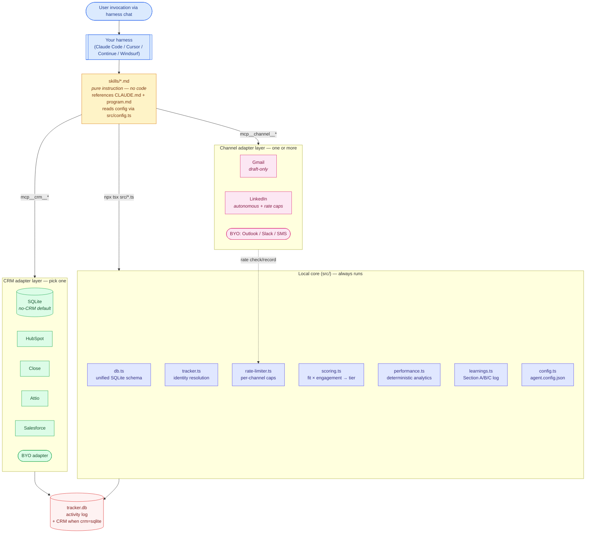

# sales-agent

> **One sales agent. Your CRM (or none). Your channels. Runs on any MCP-capable harness.**

An autonomous, skill-based sales agent with a pluggable CRM adapter layer and a
composable channel layer. Prospect, cold-touch, follow-up, classify replies,
analyze your pipeline, and close the feedback loop — all from your harness of
choice (Claude Code, Cursor, Continue, Windsurf, custom).

---

## What you get

- **Pick your CRM — or go CRM-less.** SQLite-first mode means you can start
  fresh with zero setup. Add HubSpot / Close / Attio / Salesforce later without
  rewriting anything.
- **Multiple channels.** Email (Gmail — draft-only, human sends) and LinkedIn
  (autonomous with strict rate-limits). Adding Outlook / Slack / SMS is a
  ~150-LOC extension.
- **10 composable skills.** cold-outreach, follow-up-loop, inbox-classifier,
  prospect-research, research-outreach, lead-recovery, compose-reply,
  pipeline-analysis, performance-review, contact-manager.
- **Built-in feedback loop.** Section A/B/C learnings file + deterministic
  analytics → the agent gets better over time with your explicit approval of
  every new rule.
- **Safety rails everywhere.** Per-channel rate limiter enforced before every
  send. Never-invent-details rule. Email is draft-only. LinkedIn caps stay
  below flagging thresholds. Silent rejects + transient click races are
  detected and auto-handled without halting batches.

---

## CRM support matrix

| CRM | Status | Setup | Notes |
|---|---|---|---|
| **SQLite** (no CRM) | Shipped v1 | zero | The tracker IS the CRM — start fresh, always available |
| **HubSpot** | Shipped v1 | harness OAuth | Hosted MCP at `mcp.hubspot.com/anthropic` |
| **Close** | Shipped v1 | harness OAuth | Hosted MCP at `mcp.close.com/mcp` |
| **Attio** | Shipped v1 | harness OAuth | Hosted MCP per `docs.attio.com/mcp` |
| **Salesforce** | Shipped v1 | sfdx + self-hosted MCP | `salesforcecli/mcp` |
| Pipedrive | v1.1 | self-hosted (community) | Community MCP — pin version, flag maintenance risk |
| Folk | v1.1 | self-hosted (community) | Community MCP |
| Notion / Airtable / Monday / Zoho | v1.1 | harness OAuth | First-party hosted MCPs — same pattern as HubSpot |
| **Bring your own** | always | ~150 LOC | Implement `CRMAdapter` — see `src/adapters/README.md` |

## Channel support matrix

| Channel | Status | Outbound | Rate limit |
|---|---|---|---|
| **Email (Gmail)** | Shipped v1 | Draft only (user sends) | 200 drafts/day (soft cap) |
| **LinkedIn** | Shipped v1 | Autonomous with guardrails | 20 invites/day, 80/week, 40 msgs/day, 5 personalized-notes/month |
| **Bring your own** | always | ~150 LOC | Implement `Channel` — see `src/channels/README.md` |

---

## 60-second quickstart (SQLite + email only)

```bash
# 1. Install
git clone <your-fork>/sales-agent && cd sales-agent
npm install

# 2. Wizard — writes agent.config.json + .env skeleton
npx tsx src/init.ts
# Choose: sqlite, email, fill in your name/email/offering, accept defaults.

# 3. Sanity check
npx tsx src/tracker.ts read       # → []  (empty tracker bootstraps clean)
npx tsx src/config.ts              # → prints resolved config

# 4. Invoke a skill from your harness (e.g., Claude Code)
#    Copy a template from prompts/invoke-skill.md into your chat.
```

That's it. Your first cold email campaign: point `cold-outreach` at a list of
email addresses → the agent drafts personalized messages (one per contact)
into Gmail → you review and send.

## 5-minute quickstart (with LinkedIn)

LinkedIn ships in-repo as a TypeScript scraper. No external MCP server, no
`claude mcp add`, no `uvx`. Just two extra commands on top of the email setup:

```bash
# 1. Install Chromium (one-time)
npx playwright install chromium

# 2. Set your LinkedIn display language to English BEFORE logging in.
#    Settings → Account preferences → Display language → English.

# 3. One-time interactive browser login
npx tsx src/linkedin/cli.ts login        # pops a Chromium window; sign in
npx tsx src/linkedin/cli.ts check        # → {"status":"authed"}

# 4. Re-run the wizard to add linkedin to channels
npx tsx src/init.ts
```

After that, every skill that touches LinkedIn shells out to
`npx tsx src/linkedin/cli.ts <cmd>`. The first call spawns a long-lived
warm-browser daemon (~30s); subsequent calls reuse it over a Unix socket and
return in <1s. Daemon idles out after 10 min and respawns on demand. If your
session expires, the next command auto-pops a fresh login window.

See [`src/linkedin/README.md`](src/linkedin/README.md) for the full command
reference, and [`docs/setup.md`](docs/setup.md) for the cross-CRM /
cross-channel walkthrough.

---

## The 10 skills

| Skill | One-liner |
|---|---|
| [`cold-outreach`](skills/cold-outreach.md) | First-touch; email draft or LinkedIn invite with 300-char note |
| [`follow-up-loop`](skills/follow-up-loop.md) | Re-touch silent contacts; channel-aware queue |
| [`inbox-classifier`](skills/inbox-classifier.md) | Read inboxes across all channels; classify into 8 categories; auto-handle positives |
| [`prospect-research`](skills/prospect-research.md) | Dossier per target; no sends; updates fit score |
| [`research-outreach`](skills/research-outreach.md) | Evidence-backed touch using a dossier; higher-effort, lower-volume |
| [`lead-recovery`](skills/lead-recovery.md) | Decide lever for stale leads: fresh-face / value-first / trigger / close |
| [`compose-reply`](skills/compose-reply.md) | Single high-value reply with full context assembly across channels |
| [`pipeline-analysis`](skills/pipeline-analysis.md) | Weekly zoom-out; health flags; recommends next skill |
| [`performance-review`](skills/performance-review.md) | Weekly math on what worked; proposes Section C rules (human promotes) |
| [`contact-manager`](skills/contact-manager.md) | Terminal CRUD across whichever CRM you picked |

Copy-paste invocations live in [`prompts/invoke-skill.md`](prompts/invoke-skill.md).

---

## Architecture



**Reading the diagram:**
- Your harness invokes a skill (just a markdown file).
- The skill reads `agent.config.json` to know which **CRM adapter** (exactly one) and which **channels** (one or more) are active.
- External CRM + channel calls go through MCP tools in your harness.
- Tracker / rate-limiter / scoring / performance / learnings always run locally via Node.
- `tracker.db` is the local source of truth for activity — and the CRM itself when `crm=sqlite`.

More detail in [`docs/architecture.md`](docs/architecture.md).

---

## Data model

**One row per contact** in the local `tracker.db`, keyed by UUID with unique
secondary indexes on `email` and `linkedin_url`. External-CRM linkage via
`crm_source` + `crm_id`.

Every channel gets its own columns (`email_last_draft_id`,
`linkedin_connection_status`, etc.) so signals from one channel never
overwrite the other. Replies are tagged with the channel they arrived on.

Full schema: [`src/db.ts`](src/db.ts).

### Why SQLite even when you have an external CRM?

The external CRM owns the canonical contact record. The local tracker is the
**activity log** + **scoring / rate-limit state**. Keeping them separate means:

- You can switch CRMs later without losing your agent's history.
- You can run the agent offline for research & analytics.
- Rate-limiter state doesn't pollute your CRM with agent-internal noise.
- Performance analytics run fast (indexed local queries, not N HubSpot API calls).

---

## Safety rails

- **Email is draft-only.** The agent creates Gmail drafts; you send them after
  review. Never auto-sent.
- **LinkedIn has hard caps.** 20 invites/day, 80/week, 40 messages/day, plus
  a monthly personalized-note budget (default 5/mo, LinkedIn free-tier) —
  all below LinkedIn's flagging thresholds. Per-skill enforcement via
  [`src/rate-limiter.ts`](src/rate-limiter.ts).
- **Never-invent-details rule.** Skills will skip a contact rather than
  fabricate a personalization detail.
- **Silent-reject distinct from real errors.** When LinkedIn closes the
  invite dialog without transitioning to Pending (upsell / throttle), the
  contact is skipped without consuming rate budget or counting toward the
  3-consecutive-error hard-stop.
- **One-shot auto-retry on transient click races** in `connect`; only
  genuine `send_failed` errors advance the consecutive-error counter.
- **3-error hard-stop.** After 3 consecutive `send_failed` errors, the
  skill exits and logs an observation — no silent retries past that.
- **Note-quota auto-fallback.** When the monthly personalized-note budget
  is exhausted (detected from a silent note-drop), skills continue with
  bare invites and queue the drafted note for post-accept DM delivery.
  No mid-batch prompt.
- **Match validation before LinkedIn sends.** Search results are scored on
  surname uniqueness + company + location overlap; ambiguous top hits are
  stashed in `output/research/ambiguous/` instead of shipped.
- **`do_not_contact` is honored everywhere.** Once set (by
  `inbox-classifier` on `BOUNCE`/`NEGATIVE_HARD`, or manually via
  `tracker.ts skip`), no outreach skill will touch the contact on any
  channel.
- **Section C is human-only.** `performance-review` proposes rule blocks; it
  never edits `learnings.md` Section C itself.

See [`docs/rate-limits.md`](docs/rate-limits.md) for the full safety-rail playbook.

---

## Extensibility

### Add your own CRM
```ts
// src/adapters/<my-crm>.ts
import type { CRMAdapter } from './crm.ts';
export function createMyCrmAdapter(): CRMAdapter {
  return {
    name: 'my-crm',
    async searchContacts(q) { /* map to your CRM's API / MCP */ },
    async upsertContact(c) { /* ... */ },
    // ... implement the rest of CRMAdapter
  };
}
```
1. Add `'my-crm'` to the `CRMName` union in `src/adapters/crm.ts`.
2. Add a case in `loadAdapter()`.
3. Document in `docs/crm-adapters.md`.

### Add your own channel
Same pattern — implement `Channel`, register in `channel.ts`, document in
`docs/channels.md`. If the channel has rate limits, add a key in
`src/rate-limiter.ts`.

---

## FAQ

**Do I need a CRM?** No. `sqlite` mode is first-class — the tracker serves
as your CRM. Add an external CRM when you're ready without rewriting.

**Will it send emails without my review?** No. Email is draft-only. The agent
creates drafts in Gmail; you review and send manually.

**Will it send LinkedIn messages without review?** Yes — within strict rate
limits (20 invites/day, 40 messages/day by default). Defaults are conservative.
You can tighten them in `agent.config.json` or switch to draft-only by
overriding the skill's send step.

**Can I switch CRMs later?** Yes. Change `agent.config.json` → `crm`. Existing
tracker rows keep their `crm_source` so you can migrate gradually.

**Is LinkedIn scraping allowed?** It's a grey area. Personal use only — the
in-repo scraper drives a real browser as you, with cookies you logged in
with, so it walks the same line your manual browser does. May still conflict
with LinkedIn's Terms. You assume the risk when you use it.

**What harnesses are supported?** Anything with MCP support. Tested on Claude
Code. See [`AGENTS.md`](AGENTS.md) for the compatibility matrix.

**What if my CRM doesn't have MCP support?** Two options: (a) run `sqlite`
mode and use the local tracker as your CRM; (b) write a ~150-LOC adapter that
calls your CRM's HTTP API directly. Skills don't care which — they talk to the
`CRMAdapter` interface.

---

## Project layout

```
sales-agent/
├── README.md                  # you are here
├── CLAUDE.md                  # shared message rules (cross-CRM, cross-channel)
├── AGENTS.md                  # harness compatibility
├── program.md                 # universal skill constraints
├── agent.config.json          # your configuration (written by init wizard)
├── docs/                      # setup, architecture, channels, crm-adapters, rate-limits, migration
├── src/
│   ├── db.ts tracker.ts config.ts rate-limiter.ts scoring.ts performance.ts learnings.ts init.ts
│   ├── skip-flags.ts          # hard / warm / personal skip-tier classifier
│   ├── cohort-builder.ts      # typed outreach-queue builder + CLI
│   ├── honorifics.ts          # strips Dr./Prof. Dr./Dipl.-Ing. from firstname
│   ├── adapters/              # CRM adapters (sqlite, hubspot, close, attio, salesforce)
│   ├── channels/              # Channel adapters (gmail, linkedin)
│   └── linkedin/
│       ├── match-validator.ts # post-search candidate confidence scorer
│       └── scrape/ …          # Playwright scrapers (connect, search, inbox, …)
├── skills/                    # 10 skill markdown files
├── knowledge/                 # learnings.md, scoring-config.md, research-config.md, crm-field-mapping.md
├── prompts/invoke-skill.md    # ready-to-paste skill invocations
└── output/                    # dossiers, drafts, analysis, performance reports
```

---

## License

MIT. See [`LICENSE`](LICENSE).

## Acknowledgements

Built on top of:
- [Model Context Protocol](https://modelcontextprotocol.io/) — the open standard that makes the CRM and email channels pluggable.
- [Playwright](https://playwright.dev/) (via [rebrowser-playwright](https://github.com/rebrowser/rebrowser-playwright)) — drives the in-repo LinkedIn scraper.
- First-party MCP servers from HubSpot, Close, Attio, Salesforce, and the Gmail MCP team.

Inspired by two progenitor agents (`hubspot-email-agent`, `linkedin-sales-agent`)
that proved out the patterns.
